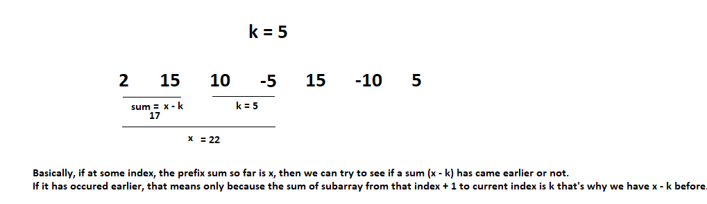

This is not a Sliding Window Problem since it includes an array with negative numbers so we cannot use sliding window approach on negative number arrays.

# PROBLEM STATEMENT

Given an array of integers nums and an integer k, return the total number of subarrays whose sum equals to k.

The array can include positive as well as negative numbers.

e.g. nums = [1,1,1] and k = 2

So, subarrays with sum = k are [1,1] and [1,1]
So, there are 2 subarrays hence, output = 2.

e.g. nums = [10,-5,15,15,-10,5] and k = 5
Here, subarrays with sum = 5 are 
[10, -5], [5] and [15,-10] => 3 Subarrays

So, output is 3. 

# BRUTE FORCE APPROACH 

Brute force approach includes going through each and every subarray and then check if the sum is k or not. So there are going to be two nested for loops.

But for very large arrays, this will not be efficient.

# EFFICIENT APPROACH USING HASHMAP

We can use prefix sum + hashmap to solve this problem in linear time.

So, we will keep a hashmap that stores how many times a particular prefix sum has occured in the map. And then, at every index, we check whether we have (prefixsum till that index - k) in that hashmap. If yes, that means, there is a subarray with sum = k

And the count will be incremented by how many times prefixSum - k occurs in map. Because lets say it occurs twice. That means, tehre are two sub-arrays with sum k between the indices that have prefixSum = prefixSum - k and current index.
