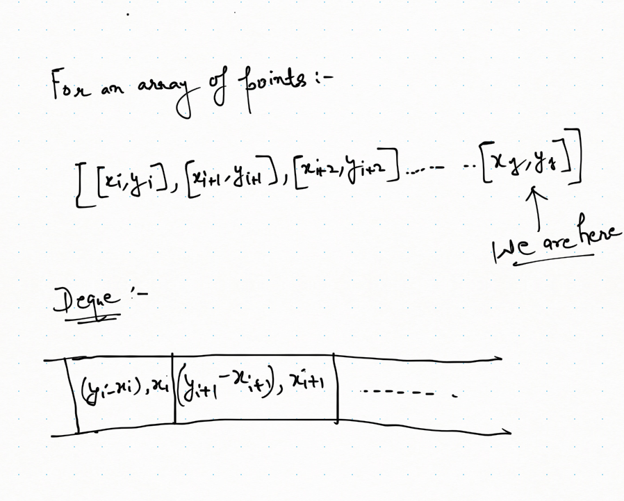

# PROBLEM STATEMENT

You are given an array points containing the coordinates of points on a 2D plane, sorted by the x-values, where points[i] = [xi, yi] such that xi < xj for all 1 <= i < j <= points.length. You are also given an integer k.

Return the maximum value of the equation yi + yj + |xi - xj| where |xi - xj| <= k and 1 <= i < j <= points.length.

It is guaranteed that there exists at least one pair of points that satisfy the constraint |xi - xj| <= k.

# EXAMPLE

Input: points = [[1,3],[2,0],[5,10],[6,-10]], k = 1
Output: 4
Explanation: The first two points satisfy the condition |xi - xj| <= 1 and if we calculate the equation we get 3 + 0 + |1 - 2| = 4. Third and fourth points also satisfy the condition and give a value of 10 + -10 + |5 - 6| = 1.
No other pairs satisfy the condition, so we return the max of 4 and 1.

# DEQUE SOLUTION

We just need to maximize one part of the given equation and that's it. Once you understand that, it is simply a variation of Sliding Window Maximum.

Given equation is -

				yi + yj + |xi - xj|

Because it is given that xj > xi that simply means, we can rewrite the equation as -

				yi + yj + xj - xi

In more simple terms - 

				(yj + xj) + (yi - xi)
				
Just think if we are at a point "j". In that case, we know what is yj + xj. 

In other words - 

		the maximum value of (yj + xj) + (yi - xi) for a point "j" will depend on the maximum value of (yi - xi) so far

So, now our problem can be divided into parts - 

	1. Find the maximum value of (yi-xi) so far (excluding current index "j")
	2. And now find the value of equation (yj + xj) + (yi - xi)
	3.  If this value of equation is bigger than previous maxValue, update the maxValue
	4.  Before moving to next point, also store the (yj-xj) value for current point somewhere

One way to find the maximum value of (yi-xi) from beginning to jth index (exluding j) is to use a variable to keep the maximum value of yi-xi so far. But what if that maximum value does not follow the condition |xi - xj| <= k. We can no longer use that. In that case, we have to use the second maximum but how to get second maximum when our variable only keeps "THE" maximum value?

And that's where deque comes into play. A Deque allows us to add and remove elements from end or beginning in constant time.
So, what we can do is keep the maximum and also the useful values in the dequeue such that in case the maximum value is not following the condition |xi - xj| <= k, we can remove it and consider the next maximum value. 

This is the same thing we did in case of Sliding Window Maximum problem

You might think - What exactly to store in the deque? We cannot just keep (yi-xi) because we also want to check the condition |xi - xj| <= k. This means, along with the value for (yi-xi), we also want to store the value for xi. So we will use a tuple (in case of Python). The tuple will be of form -

			(yi-xi, xi)

And well, that's pretty much the idea of the solution below. For every point 'j', pick the maximum value of (yi-xi) from the deque that also follows the condition |xi - xj| <= k

And then update the max value of equation if the current equation value is bigger than previous.

And before moving on to the next index, simply add the (yj-xj, xj) tuple of the deque at the right place. 

What does it mean by right place?

It means, if  (yj-xj) value is bigger than some values in deque, this means, those values will never be considered. So we can remove all those smaller values before putting  (yj-xj, xj) in the deque.

Again, this is similar to Sliding Window Maximum, where we removed all the smaller values before appending the current value.

Here is how our deque looks like - 

